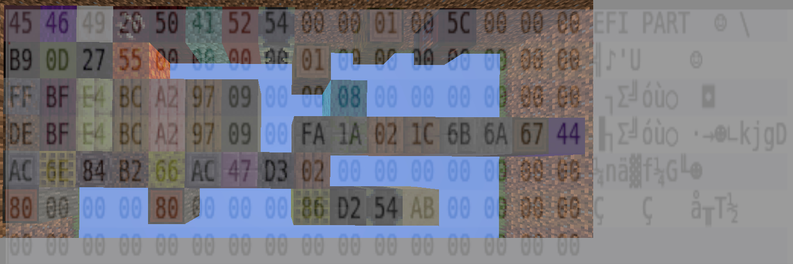
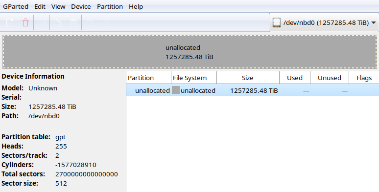
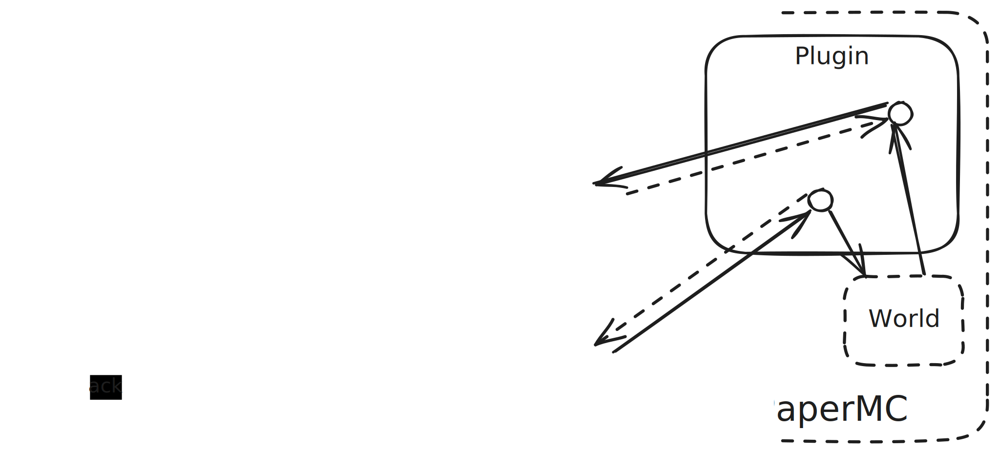
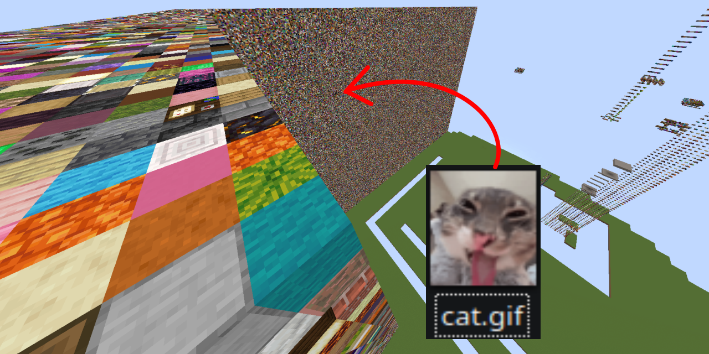

<!-- omit in toc -->
# MCDrive

MCDrive is a virtual storage device for Linux. It stores bytes as blocks in a Minecraft server.

"Why do not you use NBT?", "Why not use blockstates?", etc...? One of my personal goals was to make stored data visually interesting in-game.

<!-- omit in toc -->
# Table of contents:
- [WHY](#why)
- [HOW](#how)
- [**RUN**](#run)

## WHY

*MCDrive was **written as a joke** in two short evenings. The code is terrible and the architecture can be improved.*

I saw this [video on YouTube](https://www.youtube.com/watch?v=DSAnn5BOIBA) about a Minecraft plugin, that runs an HTTP server, which uses the in-game world itself as BLOB storage.

That implementation included a custom file system, which was far from perfect. I thought "I could do you one better" and went one layer lower in the abstraction, allowing *any* file system.

My task became very simple - mapping 3D world of Minecraft into a 1D array of bytes, and letting existing file systems handle the rest ✨. With 1382400000000000000 blocks in the overworld, and 1 byte per 1 block, the available storage space is ~1257285 TebiBytes. *This size has shown me just how buggy various partition managers can be :P*

## HOW
*Image generated by the amazing [Excalidraw](https://excalidraw.com).*

1. Linux has support for **N**etwork **B**lock **D**evices. By loading the NBD module, we create block **dev**ices called `nbdXXX` at `/dev/`. These can be used as drives, in fact, your physical drives are sitting in that folder too.
2. A C program, ran as super-user, translates `/dev/nbd0` APIs into another intermediary FIFO-based protocol. Those FIFOs are created **in userspace**.
3. Because FIFOs are accessible by a regular user, we can safely run a Minecraft server as that user. A [PaperMC](https://papermc.io/) plugin polls FIFOs and performs according changes in the Minecraft world, and the server itself provides real-time world updates to the clients.

*Performs changes in the world*? And HOW is that?

I decided to go with a "1 byte = 1 block" approach. This meant generating an alphabet of 256 blocks, which is pretty easy.
`0` has been hardcoded to "air", and the rest of the alphabet are full blocks with no gravity.

Drives must be 1-dimensional, but a Minecraft world is 3-dimensional. I decided to unwrap blocks in a chunk from bottom to top, and chunks in a world - in a spiral around the origin.
This made stored information easy to observe in-game, because it does not shoot off into the distance; it prioritizes staying close to the origin. (In addition, less regions are created this way.)

## **RUN**
*Note that the plugin is licensed under GNU GPL 3, and the NBD bridge is licensed under GNU GPL 2.*

Prerequisites
- `gcc` v14.
- `sudo`.
- A clone of this repository.
- [Latest PaperMC](https://papermc.io/downloads/all?project=paper) for 1.21.7 in `Server/server.jar`.

Running
1. Open a terminal, change CWD into `NBD-FIFO/`, and execute `./run.sh`. This does require super-user, but it must be ran as a regular user (to create FIFOs as).
2. Open a terminal, change CWD into `Server/`, and execute `./run.sh`.
3. [ONCE] Apply `/gamerule randomTickSpeed 0` to prevent data corruption.

Now you can use `/dev/nbd0` as a drive. Write to it raw, or partition it with a file system - anything your heart desires!

> [!CAUTION]
> - **Always** shutdown the NBD bridge before the Minecraft server. Press Ctrl+C to request shutdown and wait for it to exit gracefully.
> - After you shutdown the NBD bridge, you have to shutdown the server as well.

> [!NOTE]
> Linux caches IO in memory. If you make a change to the drive in-game, there is a good chance no program will detect it.
> - Filesystem cache seems to drop on unmount of its partition.
> - Drive cache seems to drop on restart of the NBD bridge.
